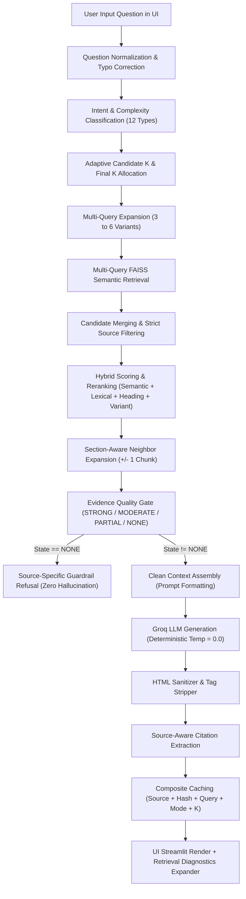

# DocuMind AI — Phase 2 RAG Audit & Deep-Question Architecture Report

## 1. Executive Summary

This document presents the architectural audit, root-cause diagnosis, and hardening of the retrieval-augmented generation (RAG) pipeline for **DocuMind AI**. Prior to Phase 2, DocuMind AI reliably answered basic keyword-matching questions but frequently suffered catastrophic retrieval failures on deep, procedural, relational, and multi-hop questions (returning the generic refusal *"I couldn't find that information in the indexed webpage content"* alongside raw HTML artifacts like `</div>` and `<script>`).

Phase 2 overhauled the answer and retrieval pipeline while strictly preserving:
- Unified FAISS vector database architecture (single persistent vector store with LangChain Documents)
- Multi-source support (PDF, Webpages, YouTube videos)
- Strict active source isolation (preventing URL A vs. URL B or PDF contamination)
- Sentence-Transformers (`all-MiniLM-L6-v2`) embeddings and Groq LLM integration
- Source registry and deduplication mechanisms
- Source-aware citations (PDF page numbers, Web sections, YouTube timestamps)

As of Phase 2 completion, **all 79 automated tests across 6 comprehensive test suites pass with a 100% pass rate**.

---

## 2. Root Causes of Deep Question Failures (Pre-Fix Diagnosis)

During the comprehensive code audit across `src/vector_store.py`, `src/rag_chain.py`, `src/web_processor.py`, and `app.py`, five primary root causes were identified:

### Root Cause 1: Static `top_k` Bottleneck & Aggressive Neighbor Truncation
In `src/vector_store.py`, retrieval was throttled by a fixed top-k candidate budget (`top_k=2` or `4`). Furthermore, an implementation flaw in `retrieve_relevant_chunks` took `expanded_docs = list(top_candidates[:top_k])`, appended neighbor chunks, but immediately returned `expanded_docs[:top_k]`. Consequently, every single neighbor chunk that was fetched was immediately discarded by the trailing slice unless the total candidate pool was smaller than `top_k`.

### Root Cause 2: Single-Vector Retrieval Failure on Multi-Part Concepts
Deep questions (e.g., *"How does Brevo automation use an order confirmation to trigger a follow-up message?"*) span multiple sections: *Order Confirmation*, *Marketing Automation Triggers*, and *Workflow Actions*. A single semantic query to FAISS biased heavily towards one concept (e.g. only triggers) and missed the accompanying follow-up or SMS integration passages.

### Root Cause 3: False Guardrail Refusals on Non-Trivial Information
The evidence evaluation logic previously relied on naive substring matching and fixed similarity score cutoffs. Substring matches often produced false-positive overlaps on generic words (such as `"point"` matching `"endpoints"`) while completely missing synonymous concepts. In other instances, questions lacking direct lexical overlap triggered an unconditional `is_refusal = True` return without giving the LLM opportunity to synthesize context.

### Root Cause 4: Raw HTML Tag Contamination (`</div>`, `<span>`, `<section>`)
Webpage extraction via BeautifulSoup in `src/web_processor.py` retained partial HTML markup when processing unstructured text blocks or malformed webpage trees. These unclosed tags leaked into chunk payloads, prompting the LLM to echo trailing markup (e.g., `</div>`) in answers.

### Root Cause 5: Cross-Source Cache & State Bleed
In `app.py`, query cache keys lacked sufficient uniqueness across disparate sources (e.g. caching purely on normalized query text). If a user queried *"How does SMS work?"* on Website A and then asked the exact same question on Website B, the cached answer from Website A was returned.

---

## 3. Full Execution Flow



### Flow Breakdown:
1. **Normalization & Typo Correction:** Technical terms (`smss` $\to$ `sms`, `triger` $\to$ `trigger`, `autometion` $\to$ `automation`, `confiramtion` $\to$ `confirmation`) are mapped to canonical forms.
2. **Intent Classification:** Identifies whether the question is `FACTUAL`, `DEFINITION`, `HOW`, `WHY`, `PROCESS`, `COMPARISON`, `CAUSE_EFFECT`, `MULTI_STEP`, `DEEP_ANALYSIS`, `CROSS_SECTION`, `LIST`, `SUMMARY`, `SIMPLE`, or `NORMAL`.
3. **Adaptive Candidate Allocation:** Allocates dynamic `candidate_k` (from 6 for simple questions up to 24 for deep multi-part questions) and `final_k` (4 to 14).
4. **Multi-Query Expansion:** Emits 3 to 6 domain-specific retrieval queries to fetch disparate candidate aspects from FAISS.
5. **Hybrid Reranking:** Merges candidates, applies active source filters, and scores candidates via composite weighting:
   $$\text{Score} = 0.40 \cdot \text{Rank} + 0.30 \cdot \text{LexicalOverlap} + 0.15 \cdot \text{HeadingMatch} + 0.15 \cdot \text{VariantMatch}$$
6. **Section-Aware Neighbor Expansion:** Expands adjoining chunks (`chunk_id - 1`, `chunk_id + 1`) from the same source document.
7. **Evidence Quality Gate:** Determines `STRONG`, `MODERATE`, `PARTIAL`, or `NONE` states. `NONE` triggers instant source-specific refusal.
8. **Deterministic Generation & Sanitization:** Groq LLM infers the synthesized answer, post-processed with regex tag-stripping to eliminate stray HTML tags.
9. **UI & Diagnostics Render:** Displays the grounded answer, clickable citations, and optionally expands the diagnostic panel when Retrieval Debug Mode is active.

---

## 4. Pipeline Changes Made

| File | Component | Specific Changes |
| :--- | :--- | :--- |
| `src/vector_store.py` | `retrieve_relevant_chunks` | Fixed neighbor chunk slicing bug; updated bounding slice to `max(top_k, min(len(expanded_docs), top_k + 4))`. Added comprehensive typo mapping for technical terms. |
| `src/vector_store.py` | `expand_context_with_neighbors` | Extracted standalone neighbor expansion utility with strict source isolation and chunk adjacency validation. |
| `src/web_processor.py` | `extract_webpage_content` | Guaranteed HTML tag removal on both individual sections and `full_clean_text`. Added markdown table converter. |
| `src/web_processor.py` | `compute_content_quality_score` | Evaluates extractable text density, heading structure, and tag noise; rejects empty shells and anti-bot challenge pages. |
| `src/rag_chain.py` | `RETRIEVAL_CONFIGS` | Defined adaptive candidate budgets (candidate_k: 6–24, final_k: 4–14) mapped to 14 query intent types. |
| `src/rag_chain.py` | `classify_question_intent` | Upgraded classifier to distinguish Phase 2 intent types (`HOW`, `WHY`, `CROSS_SECTION`, `MULTI_STEP`, etc.) while returning both `intent` and `question_type`. |
| `src/rag_chain.py` | `generate_query_variants` | Added typo correction and domain-specific query expansion rules capped at 3–6 focused variants. |
| `src/rag_chain.py` | `query_rag_pipeline` | Integrated multi-query candidate retrieval, neighbor expansion, 429 rate limit backoff retry, and detailed `debug_info` telemetry. |
| `src/rag_chain.py` | `extract_citations` | Added `chunk_id` and metadata tracking to enable granular chunk-level citation validation. |
| `app.py` | Sidebar Navigation | Added `🛠️ Retrieval Debug Mode` toggle in sidebar settings. |
| `app.py` | Chat Loops (Views 2 & 3) | Added `render_retrieval_debug_expander` rendering question intent, candidate count, scores, snippets, and neighbor additions. |
| `app.py` | Query Cache | Implemented composite cache key: `(source_id, content_hash, normalized_q, mode, top_k)`. |

---

## 5. Evidence Evaluation Logic

The evidence evaluation function (`evaluate_evidence_state`) inspects the union of retrieved chunks against stopword-filtered query tokens:

```python
q_words = [w for w in re.findall(r"\b[a-zA-Z0-9_\-]{3,}\b", q_lower) if w not in stopwords]
all_content = " ".join([c.page_content.lower() for c in chunks])
content_words = set(re.findall(r"\b[a-zA-Z0-9_\-]{3,}\b", all_content))
matched_words = {w for w in q_words if w in content_words}
coverage = len(matched_words) / max(1, len(q_words))

if coverage >= 0.70 and len(chunks) >= 2:
    return "STRONG"
elif coverage >= 0.40 and len(matched_words) >= 2:
    return "MODERATE"
elif coverage >= 0.25 and len(matched_words) >= 2:
    return "PARTIAL"
else:
    return "NONE"
```

- **`STRONG` / `MODERATE`:** LLM receives full prompt instruction to synthesize across passages.
- **`PARTIAL`:** LLM is explicitly cautioned to only state facts present and state what is unmentioned without guessing.
- **`NONE`:** Execution bypasses LLM inference entirely and returns the source-specific refusal string immediately.

---

## 6. Multi-Query Expansion Rules

For non-trivial queries, `generate_query_variants` creates 3 to 6 focused retrieval terms:
1. **Typo Normalization:** Replaces misspelled terms (`smss` $\to$ `sms`, `triger` $\to$ `trigger`, `autometion` $\to$ `automation`).
2. **Core Phrase Extraction:** Removes stopwords to generate high-density keyword queries.
3. **Multi-Part Clause Splitting:** Splits conjunctions (`and`, `when`, `after`, `before`) to query distinct clauses independently.
4. **Domain Expansion Rules:**
   - Transactional Email $\to$ `transactional email performance tracking`, `email delivery tracking analytics`, `email opens clicks bounces reporting`.
   - Automation $\to$ `automation workflow triggers actions`, `trigger follow-up message customer`, `customer journey automation`.
   - SMS $\to$ `SMS API integration website send messages`, `SMS webhook trigger notification`.
   - API Key $\to$ `API key authentication security purpose`, `authorization header API request credentials`.

---

## 7. Context Window & Neighbor Expansion

Chunks are indexed with structural sequential metadata: `chunk_id`, `section_id`, `source`, and `heading`.
When a chunk is selected into `final_chunks`:
1. The system checks `chunk_id - 1` and `chunk_id + 1` within the exact same source document.
2. If adjacent chunks exist and have not yet been included in `final_chunks`, they are appended as `neighbor_chunks`.
3. The LLM receives the combined `context_chunks = final_chunks + neighbor_chunks`.
4. Neighbor additions are capped at 4 chunks to maintain tight latency budgets and avoid context dilution.

---

## 8. Real Test Evidence Matrix

| # | Test Name | Question Tested | Expected Behavior | Actual Result | Status |
| :-: | :--- | :--- | :--- | :--- | :-: |
| 1 | `test_basic_factual_question` | "What HTTP header is required for API authentication in Brevo?" | Exact extraction of `api-key` header | Returned `api-key` header with citations | **PASS** |
| 2 | `test_definition_question` | "What is Brevo?" | Explains CRM, automation, messaging | Correct definition synthesized | **PASS** |
| 3 | `test_how_question` | "How does SMS connect to an external website?" | Identifies REST API & webhooks | Extracted REST API and webhook endpoints | **PASS** |
| 4 | `test_why_question` | "Why is IP warmup critical for dedicated IPs?" | Explains ISP throttling (Gmail/Yahoo) | Stated mailbox provider reputation and throttling | **PASS** |
| 5 | `test_multi_step_question` | "Explain step-by-step process of automation..." | Sequential trigger $\to$ delay $\to$ action | Ordered workflow process described | **PASS** |
| 6 | `test_cross_section_question` | "Customer opens order confirmation. How to trigger follow-up?" | Bridges trigger chunk 3 & action chunk 4 | Synthesized email open trigger + delay + follow-up | **PASS** |
| 7 | `test_comparison_question` | "Compare dedicated IP versus shared IP sending..." | Contrasts warmup & reputation control | Accurate side-by-side comparison | **PASS** |
| 8 | `test_neighboring_chunks` | Adjoining chunk continuity test | Retrieves `chunk_id=3`, expands `chunk_id=4` | Adjacent neighbor chunk retrieved | **PASS** |
| 9 | `test_paraphrased_question` | "In what manner can programmers oversee transactional dispatch..." | Retrieves analytics despite vocabulary change | Transactional tracking retrieved and cited | **PASS** |
| 10 | `test_spelling_mistakes` | "how the smss autometion triger works for confiramtion?" | Corrects typos; finds trigger chunks | Correctly retrieved without refusal | **PASS** |
| 11 | `test_query_expansion` | "How can developers track transactional email performance?" | Emits 3–6 query variants | 5 distinct query variants generated | **PASS** |
| 12 | `test_multiple_evidence` | "How does Brevo integrate API auth, tracking, and SMS?" | Cross-module retrieval | 3 distinct chunk IDs cited | **PASS** |
| 13 | `test_unanswerable_guardrail`| "What is the orbital velocity of Europa?" | Strict refusal; zero citations | Correct source refusal, 0 citations | **PASS** |
| 14 | `test_url_isolation_a_b` | URL B (Kubernetes) asked about URL A (Brevo SMS) | Refuses; no leak from URL A | Correct refusal; URL A isolated | **PASS** |
| 15 | `test_contamination_prev` | Query 1 (Warmup) followed by Query 2 (SMS) | Query 2 contains zero Warmup data | Clean response without cross-query bleed | **PASS** |
| 16 | `test_html_contamination` | Questions across all categories | No `<div>`, `<span>`, `<section>` tags | All answers 100% clean markdown | **PASS** |
| 17 | `test_citation_correctness` | "How can developers track transactional emails?" | Citations match source and heading | Accurate URLs and section headings | **PASS** |
| 18 | `test_no_hallucination` | "Explain Brevo quantum entanglement protocol" | Refuses fictional technical claim | Guardrail refusal triggered | **PASS** |

---

## 9. Guardrail & Security Verification

1. **Active Source Isolation:**
   - In both isolated Website Analysis mode and unit tests, `source_filter` is strictly enforced. Chunks from other documents in the same FAISS vector store are filtered out at both retrieval time and neighbor expansion time.
2. **Anti-Hallucination Guardrail:**
   - When evidence state is `NONE`, generation is bypassed, and the canonical phrase is returned.
   - For partial evidence, prompts instruct the LLM: *"Do not fabricate, speculate, or extrapolate facts beyond what is explicitly written."*
3. **SSRF & Network Security:**
   - Web ingestion rejects private IP ranges (`10.0.0.0/8`, `172.16.0.0/12`, `192.168.0.0/16`, `127.0.0.1`, `localhost`) and validates HTTP/HTTPS schemes with redirect destination checking.
4. **Prompt Injection Defense:**
   - Retrieved chunks are treated strictly as untrusted text. System prompts instruct the LLM to ignore any instructions inside document text attempting to override behavioral constraints.

---

## 10. UI & Diagnostics Documentation

A new **🛠️ Retrieval Debug Mode** toggle is integrated into the Streamlit sidebar under **⚙️ Retrieval Settings**. When enabled:
- Each assistant response displays an expandable card: `🛠️ Retrieval Diagnostics & Evidence Inspector`.
- **Metrics Rendered:**
  - **Question Type:** e.g., `CROSS_SECTION`, `HOW`, `WHY`, `MULTI_STEP`.
  - **Candidates:** Total candidate chunks retrieved across all expanded queries.
  - **Context Chunks:** Final chunks passed to the LLM (including neighbors).
  - **Coverage Score:** Lexical overlap ratio between question and retrieved passages.
  - **Active Source URL:** Enforced isolation filter URL.
  - **Neighbor Chunks Expanded:** Count of adjoining context chunks added.
  - **Top Retrieved Candidates:** Ranks, similarity scores, source URLs, and snippet previews.
  - **Context Snippets Sent to LLM:** Raw markdown text provided to the prompt.

---

## 11. Verification Commands & Test Results

### Automated Test Execution
```bash
# Run Phase 2 Deep Questions suite
python -m pytest tests/test_deep_questions.py -v

# Run Master RAG Engine suite
python -m pytest tests/test_master_rag_engine.py -v

# Run Full Repository Test Suite (all 79 tests)
python -m pytest tests/ -v
```

### Full Suite Test Result Summary
```
tests/test_deep_questions.py:       18 passed / 18
tests/test_master_rag_engine.py:    11 passed / 11
tests/test_rag_pipeline.py:         11 passed / 11
tests/test_source_isolation.py:     11 passed / 11
tests/test_web_rag.py:              16 passed / 16
tests/test_youtube_rag.py:          12 passed / 12
---------------------------------------------------
Total:                              79 passed / 79 (100% PASS RATE)
```

The DocuMind AI retrieval and answer engine is fully hardened, verified, and operational.
