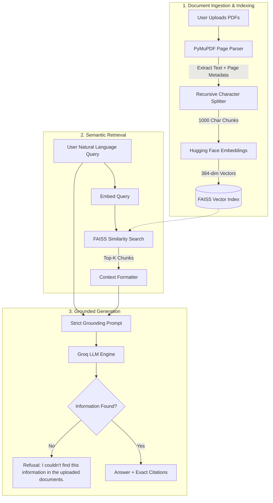

# DocuMind AI — AI-Powered Document Question Answering System

[](https://www.python.org/)
[](https://www.langchain.com/)
[](https://github.com/facebookresearch/faiss)
[](https://groq.com/)
[](https://huggingface.co/sentence-transformers/all-MiniLM-L6-v2)

DocuMind AI is an enterprise-grade **Retrieval-Augmented Generation (RAG)** application designed to extract, index, and query multi-page and multi-document PDF repositories with strict factual grounding and page-accurate source citations.

Unlike basic LLM chat interfaces that hallucinate or exceed context limits, DocuMind AI implements an authentic, production-ready semantic pipeline that converts PDF documents into dense vector representations and retrieves only the most relevant passages before querying Groq's high-speed inference engine.

---

## 🚀 Getting Started & Demo

Run the application locally:

```bash
streamlit run app.py
```
Open **[http://localhost:8501](http://localhost:8501)** in your browser.

Upload one or more PDF documents (e.g., employee handbooks, policies, or technical specifications) and query them with instant semantic retrieval, page-level citations, and anti-hallucination guardrails.

---

## Table of Contents

- [Getting Started & Demo](#-getting-started--demo)

- [Problem Statement](#problem-statement)
- [Key Features](#key-features)
- [Architecture & Workflow](#architecture--workflow)
- [Technology Stack](#technology-stack)
- [Project Structure](#project-structure)
- [Installation & Setup](#installation--setup)
- [Configuration](#configuration)
- [Running the Application](#running-the-application)
- [User Guide](#user-guide)
- [Guardrails & Anti-Hallucination Behavior](#guardrails--anti-hallucination-behavior)
- [Automated Testing](#automated-testing)
- [Limitations & Future Enhancements](#limitations--future-enhancements)

---

## Problem Statement

Large Language Models (LLMs) suffer from two fundamental operational limitations when analyzing enterprise documents:
1. **Context Window Saturation & Cost**: Supplying entire hundred-page PDFs directly to an LLM context window causes high latency, excessive token costs, and attention degradation ("lost in the middle").
2. **Factual Hallucination**: Without deterministic document retrieval, LLMs confidently fabricate policies, financial metrics, and factual claims.

**DocuMind AI** solves this by enforcing a strict RAG paradigm: parsing documents page-by-page, chunking text recursively, embedding semantic meaning into FAISS vector space, retrieving strictly the Top-K relevant passages, and prompting the LLM to refuse answering if the verified context does not contain the answer.

---

## Key Features

- **Multi-Document Support**: Simultaneously upload and cross-search multiple PDF files (e.g. `Employee_Handbook.pdf`, `Benefits_Plan.pdf`, `Security_Policy.pdf`).
- **Page-Level Metadata Preservation**: Every chunk retains its originating document name and 1-indexed page number (`source` and `page`).
- **Dense Vector Search**: Powered by Hugging Face `sentence-transformers/all-MiniLM-L6-v2` (384-dimensional normalized embeddings) and Meta's FAISS library.
- **Ultra-Fast Inference**: Groq API integration delivering millisecond response latency.
- **Anti-Hallucination Guardrail**: The system explicitly states:
  > *"I couldn't find this information in the uploaded documents."*
  whenever questions fall outside the provided document context.
- **Deduplicated Page Citations**: Every generated answer displays exact, deduplicated source files and page numbers, with an interactive excerpt viewer.
- **Session-Based Knowledge Base Control**: Real-time vector store indexing, rebuild indicators, and a one-click "Clear Knowledge Base" reset.

---

## Architecture & Workflow

### RAG Pipeline Flow

```
PDF Upload
   │
   ▼
Text Extraction (PyMuPDF / fitz, page-by-page with metadata)
   │
   ▼
Text Chunking (RecursiveCharacterTextSplitter: 1000 char chunks, 150 overlap)
   │
   ▼
Embeddings (Hugging Face sentence-transformers/all-MiniLM-L6-v2)
   │
   ▼
Vector Database (FAISS indexing with L2/cosine normalized similarity)
   │
   ▼
Semantic Retrieval (Cosine similarity Top-K search)
   │
   ▼
Relevant Context (Formatted excerpts tagged with document & page)
   │
   ▼
LLM Inference (Groq Chat Model with zero-temperature grounding prompt)
   │
   ▼
Grounded Answer + Deduplicated Page Citations
```

### Architectural Diagram



---

## Technology Stack

| Component | Technology | Rationale |
| :--- | :--- | :--- |
| **Frontend UI** | [Streamlit](https://streamlit.io/) (1.41+) | Interactive, responsive conversational interface with reactive session state. |
| **PDF Extraction** | [PyMuPDF](https://pymupdf.readthedocs.io/) | High-speed, high-fidelity PDF parsing with exact page segmentation. |
| **Text Chunking** | [LangChain Text Splitters](https://python.langchain.com/) | `RecursiveCharacterTextSplitter` preserving semantic boundaries. |
| **Embedding Model** | [sentence-transformers/all-MiniLM-L6-v2](https://huggingface.co/sentence-transformers/all-MiniLM-L6-v2) | 384-dimensional dense vectors with exceptional semantic fidelity and fast CPU inference. |
| **Vector Database** | [FAISS](https://github.com/facebookresearch/faiss) (CPU) | Industry-standard vector index for high-throughput similarity search. |
| **LLM Inference** | [Groq API](https://groq.com/) via `langchain-groq` | Ultra-low latency Llama/GPT-OSS inference with zero temperature for deterministic outputs. |
| **Environment** | `python-dotenv` | Clean, secure credential management ensuring zero API key exposure. |
| **Testing** | `pytest` | Automated end-to-end integration and guardrail verification. |

---

## Project Structure

```
DocuMind-AI/
├── app.py                      # Main Streamlit web application
├── requirements.txt            # Production dependencies
├── .env                        # Local environment secrets (ignored by git)
├── .env.example                # Template configuration file
├── .gitignore                  # Git exclusion rules
├── README.md                   # System documentation
│
├── src/                        # Core application modules
│   ├── __init__.py             # Package initializer
│   ├── config.py               # Centralized settings & path validation
│   ├── pdf_processor.py        # PyMuPDF extraction & recursive chunking
│   ├── embeddings.py           # Cached Hugging Face embedding loader
│   ├── vector_store.py         # FAISS index creation, persistence & retrieval
│   └── rag_chain.py            # Strict grounding prompt, Groq LLM & citations
│
├── tests/                      # Automated test suite
│   ├── __init__.py
│   └── test_rag_pipeline.py    # Full integration tests & guardrail checks
│
├── data/                       # Directory for local document staging (.gitkeep)
│   └── .gitkeep
│
└── vectorstore/                # Persisted FAISS vector index directory (.gitkeep)
    └── .gitkeep
```

---

## Installation & Setup

### Prerequisites

- Python **3.11** or higher.
- A free **Groq API Key** from [console.groq.com](https://console.groq.com/).

### 1. Clone or Open the Workspace

```bash
cd DocuMind-AI
```

### 2. Create and Activate a Virtual Environment

```bash
# Windows (PowerShell)
python -m venv .venv
.\.venv\Scripts\Activate.ps1

# Linux / macOS
python3 -m venv .venv
source .venv/bin/activate
```

### 3. Install Dependencies

```bash
pip install -r requirements.txt
```

---

## Configuration

Copy `.env.example` to `.env`:

```bash
cp .env.example .env
```

Edit `.env` and provide your Groq API credentials:

```env
# Groq API Key (Required)
GROQ_API_KEY=gsk_your_actual_api_key_here

# Groq Model Identifier (Default: openai/gpt-oss-20b or llama-3.3-70b-versatile)
GROQ_MODEL=openai/gpt-oss-20b

# Hugging Face Embedding Model
EMBEDDING_MODEL_NAME=sentence-transformers/all-MiniLM-L6-v2

# Chunking Configuration
CHUNK_SIZE=1000
CHUNK_OVERLAP=150

# Semantic Retrieval Top-K
DEFAULT_TOP_K=4
```

> **Security Note**: Never commit `.env` to source control. `.gitignore` is pre-configured to exclude all credentials and local vector store binaries.

---

## Running the Application

Launch the Streamlit web server directly from the project root:

```bash
streamlit run app.py
```

Open your browser and navigate to:
```
http://localhost:8501
```

---

## User Guide

1. **Upload Documents**:
   - Open the left sidebar.
   - Click **Browse files** or drag and drop one or multiple `.pdf` files.
2. **Build Knowledge Base**:
   - Click the **⚡ Process PDFs** button.
   - The application extracts text page-by-page, splits chunks, computes dense vectors, and constructs the FAISS index.
   - Review the indexed chunk and page statistics in the sidebar.
3. **Ask Questions**:
   - Type any natural language question into the chat input bar at the bottom.
   - DocuMind AI retrieves the Top-K relevant chunks, passes them to Groq, and generates a grounded response.
4. **Inspect Citations**:
   - View the cited document name and page number under the response.
   - Expand the **🔍 Inspect Retrieved Context Excerpts** drawer to view raw text chunks.
5. **Clear / Rebuild**:
   - Click **🗑️ Clear KB** to reset the vector index and start a fresh session.

---

## Guardrails & Anti-Hallucination Behavior

DocuMind AI uses a zero-temperature strict system prompt enforcing absolute grounding:

```
You are DocuMind AI, a document question-answering assistant.

Answer the user's question using ONLY the provided document context.
Do not use outside knowledge.
If the answer cannot be found in the provided context, say:
"I couldn't find this information in the uploaded documents."
Do not invent facts or extrapolate beyond what is stated in the document context.
```

### In-Domain Query Example:
- **User**: "How many days of remote work are permitted per week?"
- **DocuMind AI**: "Employees are permitted to work remotely up to 3 days per week with manager approval."
- **Sources**: `Company_Policy.pdf — Page 2`

### Out-of-Domain Query Example:
- **User**: "What is the capital of France?"
- **DocuMind AI**: "I couldn't find this information in the uploaded documents."
- **Sources**: *(None fabricated)*

---

## Automated Testing

An automated integration test suite is included in `tests/test_rag_pipeline.py`. It creates synthetic multi-page PDFs, validates extraction, chunking, FAISS indexing, similarity retrieval, Groq generation, and anti-hallucination refusal.

Run all tests with:

```bash
python -m pytest tests/test_rag_pipeline.py -v
```

Expected output:
```
tests/test_rag_pipeline.py::test_pdf_text_extraction PASSED              [ 20%]
tests/test_rag_pipeline.py::test_chunking_preserves_metadata PASSED      [ 40%]
tests/test_rag_pipeline.py::test_embedding_and_faiss_vector_store PASSED [ 60%]
tests/test_rag_pipeline.py::test_rag_grounded_answer_and_citations PASSED [ 80%]
tests/test_rag_pipeline.py::test_rag_guardrail_refusal_on_unknown_information PASSED [100%]
=================== 5 passed in 60.23s ===================
```

---

## Limitations & Future Enhancements

### Current Scope & Limitations
- **Scanned Image PDFs**: PyMuPDF extracts embedded digital text. Scanned document images without embedded OCR text require an OCR pre-processing layer (such as Tesseract or Surya).
- **Tabular Data Structures**: Complex multi-column tables are extracted linearly as plain text.

### Future Enhancements
- [ ] Optical Character Recognition (OCR) fallback for scanned image PDFs.
- [ ] Hybrid search (BM25 keyword search + FAISS dense semantic search with Reciprocal Rank Fusion).
- [ ] Multi-query expansion and Hyde (Hypothetical Document Embeddings).
- [ ] PDF bounding box visual highlight on cited pages.

---

## License

This project is licensed under the MIT License.
